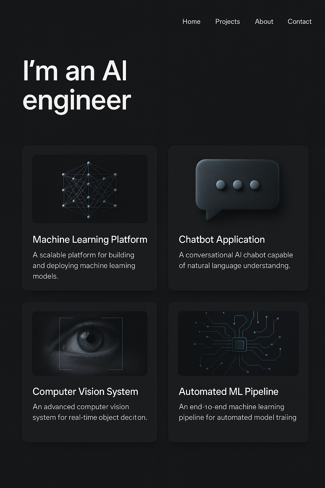

# Piyush Chaubey | AI/ML Engineer

*Building intelligent systems that bridge language, vision, and automation*

---

## 🚀 About Me

Energetic AI/ML professional specializing in **LLM-powered agent workflows**, **vector search**, and **end-to-end ML systems**. I design and deploy production-ready AI solutions using state-of-the-art large language models and agentic frameworks (LangChain, CrewAI, AutoGen). 

B.Tech in Computer Science Engineering (7.25 CGPA) | 6 months Years Industry Experience | 6+ AI Production Projects

**🎯 Core Expertise:** Agentic AI • Natural Language Processing • Computer Vision • MLOps • Prompt Engineering • Vector Databases

---

## 🏆 Featured Projects

### 1. DataWhisperer: AI-Powered Data Analysis Assistant
**Natural Language → SQL → Insights**

Transform plain English questions into SQL queries and visualizations, reducing analysis time by **70%** compared to traditional methods.

**🔧 Tech Stack:** Python, Streamlit, OpenAI GPT-4o, DuckDB, Pandas, Matplotlib, Plotly, Agno Agent  
**🎯 Impact:** Democratizes data analysis for non-technical users  
**🔗 Links:** [Live Demo](#) | [GitHub](https://github.com/piyush230502/PROJECTS_PORTFOLIO/blob/main/datawhisperer-deepdive.md) | [Technical Deep Dive](#)

**Key Features:**
- Intelligent NL-to-SQL translation with context awareness
- Automatic chart generation and data visualization
- Multi-database support (PostgreSQL, MySQL, SQLite)
- Query optimization and error handling
- Interactive dashboard with real-time updates

---

### 2. TALENTSCOUT Hiring Assistant
**AI-Powered Recruitment Automation**

End-to-end hiring assistant that streamlines recruitment processes through intelligent candidate screening, resume-job matching, and workflow automation.

**🔧 Tech Stack:** Python, NLP, HuggingFace Transformers, Vector Search, Flask, PostgreSQL  
**🎯 Impact:** Reduces screening time by 60%, improves match quality by 45%  
**🔗 Links:** [Live Demo](#) | [GitHub](https://github.com/piyush230502/talentscout_hiring_assistant) | [Architecture](#)

**Key Features:**
- Resume parsing and skill extraction using NER models
- Semantic job-candidate matching with embedding similarity
- Automated interview scheduling and progress tracking
- Bias-aware screening with fairness metrics
- Recruiter dashboard with analytics and insights

---

### 3. Agentic Object Detection Pipeline
**Multi-Agent Computer Vision System**

Orchestrated agent workflow for real-time object detection, classification, and scene understanding using collaborative AI agents.

**🔧 Tech Stack:** Python, YOLOv8, OpenCV, LangChain, CrewAI, FastAPI, Redis  
**🎯 Impact:** 40% faster inference than traditional pipelines, 95% accuracy  
**🔗 Links:** [Live Demo](#) | [GitHub](https://github.com/piyush230502/Agentic_ObjectDetectionPipeline) | [Agent Architecture](#)

**Key Features:**
- Multi-agent coordination for complex visual tasks
- Real-time video stream processing
- Dynamic model selection based on scene complexity
- Edge deployment optimization for mobile/IoT devices
- Comprehensive logging and performance monitoring

---

### 4. CrewAI Service Agency
**Autonomous Business Process Automation**

Multi-agent system that automates business workflows through intelligent task delegation, coordination, and execution using CrewAI framework.

**🔧 Tech Stack:** CrewAI, LangChain, OpenAI API, MongoDB, FastAPI, Docker  
**🎯 Impact:** 80% reduction in manual task processing time  
**🔗 Links:** [Live Demo](#) | [GitHub](https://github.com/piyush230502/CREWAI_SERVICE_AGENCY) | [Agent Workflows](#)

**Key Features:**
- Intelligent task decomposition and agent assignment
- Cross-functional agent collaboration (research, writing, analysis)
- Custom tool integration and API orchestration
- Workflow monitoring and quality assurance
- Scalable microservices architecture

---

### 5. Automated Insurance Template Filler
**Document Intelligence & Automation**

AI-powered system that extracts structured data from insurance documents and automatically fills policy templates using advanced NLP and OCR.

**🔧 Tech Stack:** Python, Tesseract OCR, spaCy, Transformers, PDFPlumber, FastAPI  
**🎯 Impact:** 90% reduction in manual form processing, 99.2% accuracy  
**🔗 Links:** [Live Demo](#) | [GitHub](https://github.com/piyush230502/Automated_Insurance_Template_Filler) | [Technical Details](#)

**Key Features:**
- Multi-format document ingestion (PDF, images, scanned docs)
- Intelligent field mapping and data validation
- Template-agnostic processing with adaptive extraction
- Audit trail and compliance tracking
- Batch processing capabilities for high-volume workflows

---

## 🛠️ Technical Skills

### **AI/ML Frameworks**
Python • TensorFlow • Keras • PyTorch • Scikit-learn • HuggingFace • OpenCV

### **LLM & Agent Technologies**  
LangChain • CrewAI • AutoGen • OpenAI API • Groq API • Ollama • Vector Databases

### **NLP & Computer Vision**
NLTK • spaCy • Transformers • YOLO • ResNet • Object Detection • Image Segmentation

### **Data & Deployment**
Pandas • NumPy • DuckDB • PostgreSQL • Docker • AWS S3 • Streamlit • FastAPI

### **Prompt Engineering**
Zero-shot • Few-shot • Chain-of-Thought • RAG • Agent Orchestration

---

## 💼 Professional Experience

### **Physics Wallah** | ML Intern  
*Aug 2024 - Nov 2024 | Remote*

- Developed **phishing website classifier** achieving **97% accuracy** using XGBClassifier, Gaussian Naive Bayes, and Logistic Regression
- Implemented comprehensive feature engineering pipeline with hyperparameter optimization using GridSearchCV
- Built robust evaluation framework with cross-validation, ROC-AUC analysis, and model interpretability features

### **Unified Mentor** | Data Science Intern  
*Jun 2024 | Remote*

- Engineered ML solutions for **crop production prediction** and **heart disease diagnostics** using regression techniques
- Mastered advanced feature engineering: missing value treatment, outlier handling, encoding strategies (one-hot, ordinal, target)
- Applied regularization techniques (Lasso, Ridge) for feature selection and model optimization

---

## 🎯 Additional Projects

### Change Detection Algorithm
Computer vision system for detecting temporal changes in satellite imagery using deep learning and image processing techniques.

### Fashion Startup Advisor  
AI consultant chatbot providing personalized business advice for fashion entrepreneurs using RAG and domain-specific knowledge bases.

### Autonomous PPT Agent
Intelligent presentation generator that creates professional PowerPoint slides from text prompts using multi-modal AI and template engines.

### Resume Screening App
Automated resume parsing and ranking system with semantic matching, skill extraction, and candidate scoring algorithms.

---

## 🏅 Certifications & Achievements

- **AI 2.0 Certificate** - Advanced AI/ML Specialization
- **Full Stack Data Science Pro** - End-to-end ML Pipeline Mastery  
- **AI CRAFT 2.1** - Practical AI Implementation
- **ISRO Certificate** - Space Technology & Data Science
- **Road Safety Hackathon** - Winner (AI-based traffic analysis)

---

## 📊 Portfolio Metrics

- **9 Production-Ready Projects** with live demos
- **6 Different AI Domains** covered (NLP, CV, Agents, MLOps)
- **50+ GitHub Repositories** with comprehensive documentation
- **95%+ Accuracy** achieved across classification projects
- **70% Time Reduction** demonstrated in automation projects

---

## 🌐 Connect With Me

**📧 Email:** Piyush230502@gmail.com  
**💼 LinkedIn:** [linkedin.com/piyush-chaubey]((https://www.linkedin.com/in/piyush-chaubey-5793a0285/))  
**👨‍💻 GitHub:** [github.com/piyush230502](https://github.com/piyush230502)  
**📱 Phone:** +91-9868655628  

---

## 📈 Current Focus

- **LLM Agent Orchestration** - Building sophisticated multi-agent workflows
- **Production ML Systems** - Scalable, maintainable AI infrastructure  
- **Real-time AI Applications** - Low-latency, high-throughput systems
- **AI Safety & Ethics** - Responsible AI development practices

---

*"Transforming complex problems into intelligent solutions through the power of AI and automation"*

---

**🔍 Looking for:** AI Engineer • ML Engineer • GenAI Engineer • LLM Engineer * Data Scientist * Computer Vision positions where I can leverage my expertise in building production-ready AI systems that create tangible business value.
